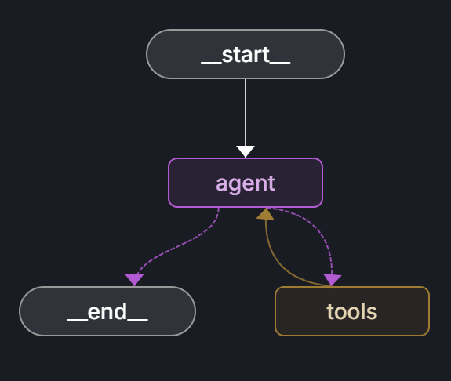
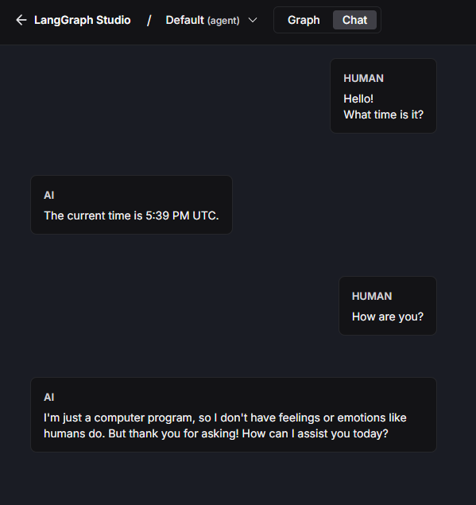
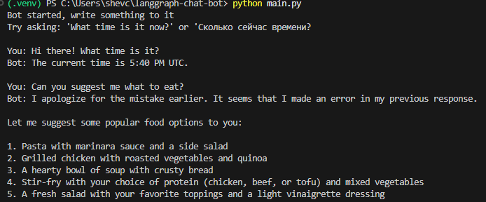

# LangGraph Chatbot with Time Tool

A stateless chatbot built with LangGraph.

## Tech Stack

* **LangGraph** - for building the agent's state graph;
* **LangChain** - for working with language models;  
* **Ollama** - for running LLMs locally;
* **Python 3.11**

## Architecture

The bot is built using a state graph with two main nodes:
* **Agent** - processes user messages using the LLM
* **Tools** - executes the `get_current_time` tool when needed



*Graph of the chatbot rendered by the LangGraph UI*

## Features

* Regular conversation with users
* Time checking on request ("What time is it?", "Который час?")
* Returns time in UTC ISO-8601 format
* Stateless architecture (no chat history saved)

## Installation and Setup

### 1. Install Ollama
Download and install Ollama from the official site: https://ollama.ai

### 2. Download the model

```bash
ollama pull llama3.2
```

Make sure Ollama is running on the default port (11434):

```bash
ollama serve
```

### 3. Clone and setup the project

```bash
git clone https://github.com/elladiell/lang-chat-bot.git
cd lang-chat-bot
python -m venv .venv && source .venv/bin/activate
pip install -r requirements.txt
```

## Running the Bot

### Option 1: LangGraph Dev 

```bash
langgraph dev
```

After starting, open your browser and go to the provided address (usually http://localhost:8123). You'll see a web interface for testing the bot.

**Note:** If you encounter an error related to blocking operations, try running the command with the `--allow-blocking` flag:

```bash
langgraph dev --allow-blocking
 ```
 
This may be required in some environments where blocking I/O is restricted by default.



*Chatbot interaction in LangGraph UI*


### Option 2: Console testing

```bash
python main.py
```

This runs local testing in the console.



*Chatbot CLI interaction in local environment*

## Usage Examples

### Time requests

```
User: What time is it?
Bot: The current time is 2025-05-23T16:42:30Z.

User: Который час?
Bot: Сейчас 2025-05-23T16:42:30Z по UTC.
```

## Code Structure

* `get_current_time()` - tool for getting current UTC time
* `setup_model()` - configures Ollama model with tool binding
* `should_continue()` - logic for determining when to call tools
* `call_model()` - main message processing function
* `create_graph()` - creates the LangGraph state graph

## Configuration

You can modify these parameters in the code:
* **Temperature**: change the `temperature` value for more/less creative responses
* **Ollama port**: change `base_url` if Ollama runs on a different port

## Requirements

* Python 3.11
**Note:** LangGraph Dev requires **Python 3.11** specifically and may not work with earlier versions.
Make sure your environment uses Python 3.11 to avoid compatibility issues during development.
* Ollama with llama3.2 model
* At least 8GB RAM for comfortable model performance

## Troubleshooting

**Model mixes languages in responses:**
* Try lowering temperature to 0.1

**Ollama connection error:**
* Make sure the service is running: `ollama serve`
* Check that the model is downloaded: `ollama list`

**Time tool doesn't trigger:**
* Check your request phrasing (use keywords like "time", "час", "время")
* Make sure the model supports function calling

## Notes

I initially tested this with DeepSeek and OpenAI ChatGPT models, but since access to their APIs is paid, I switched to using Ollama for a free local solution.